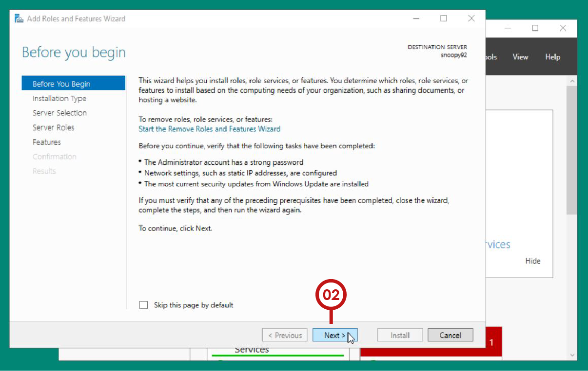
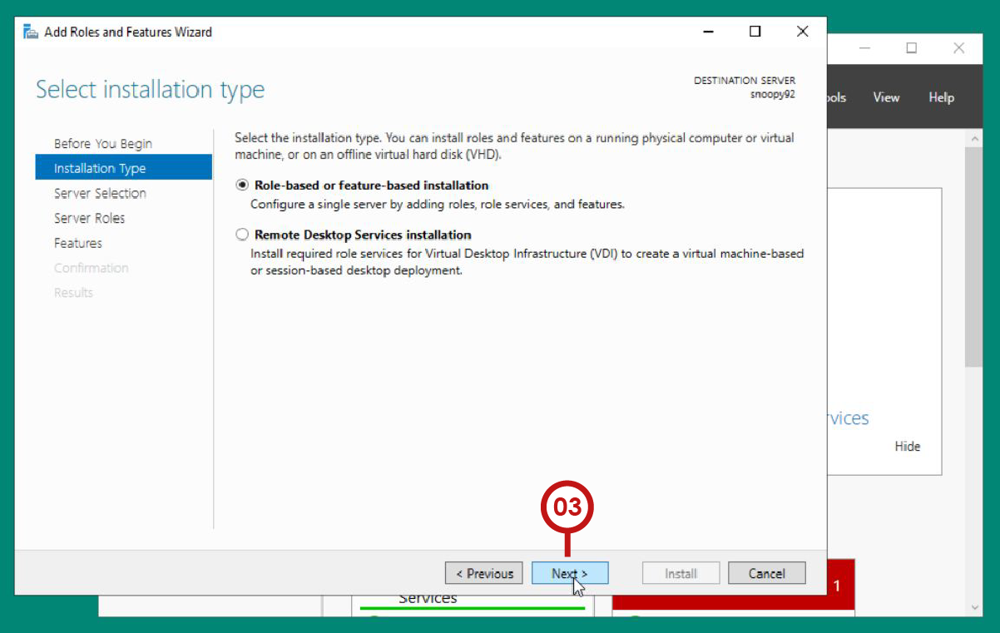
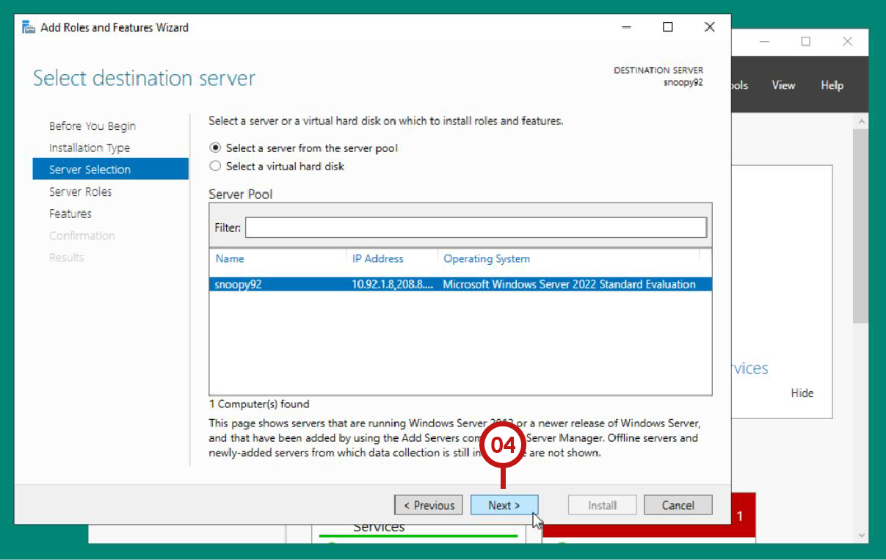
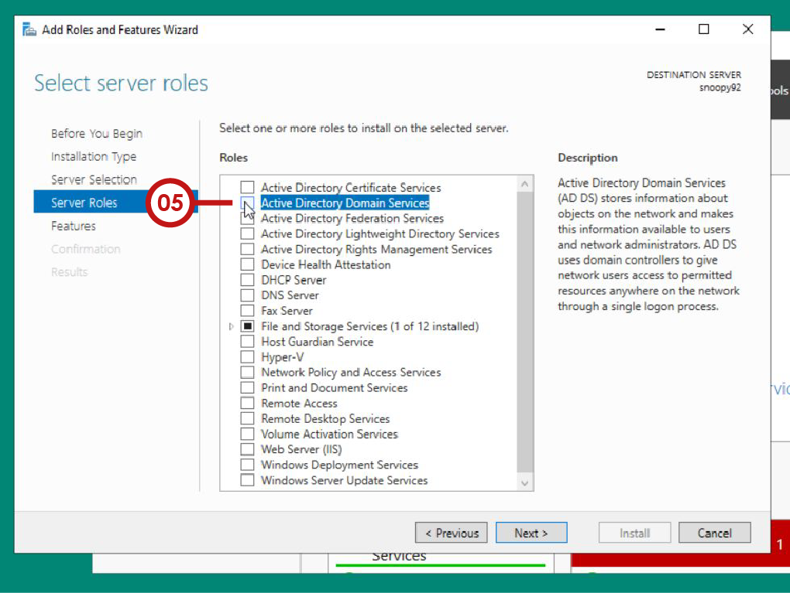
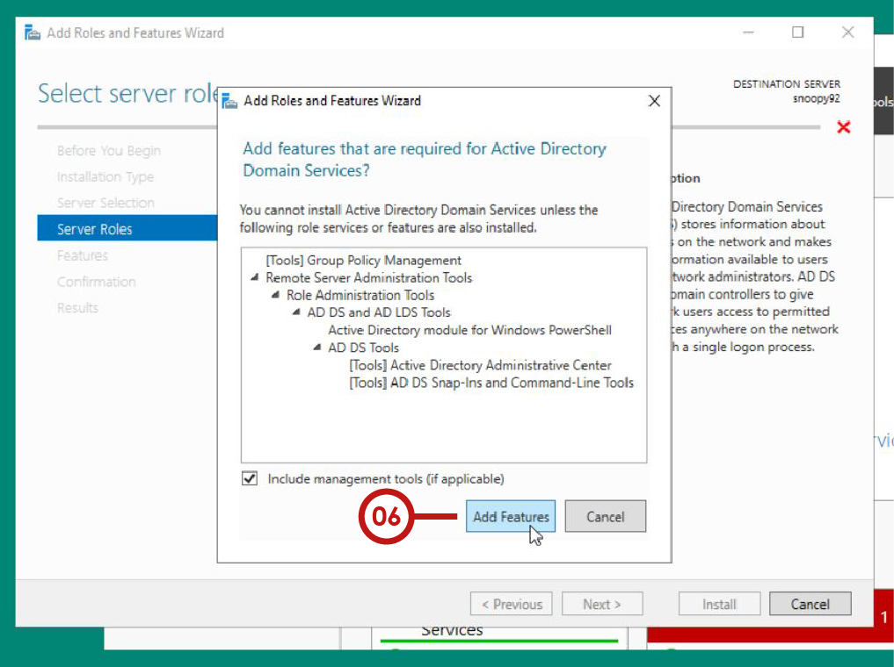
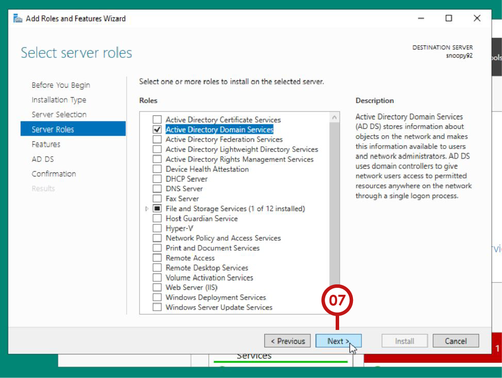
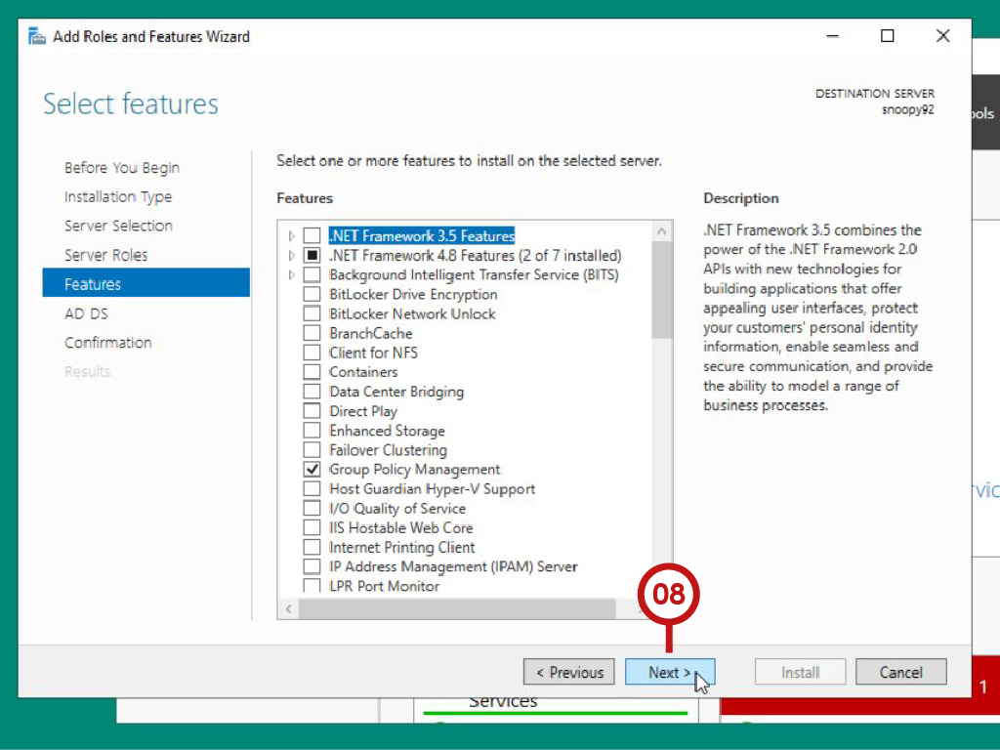
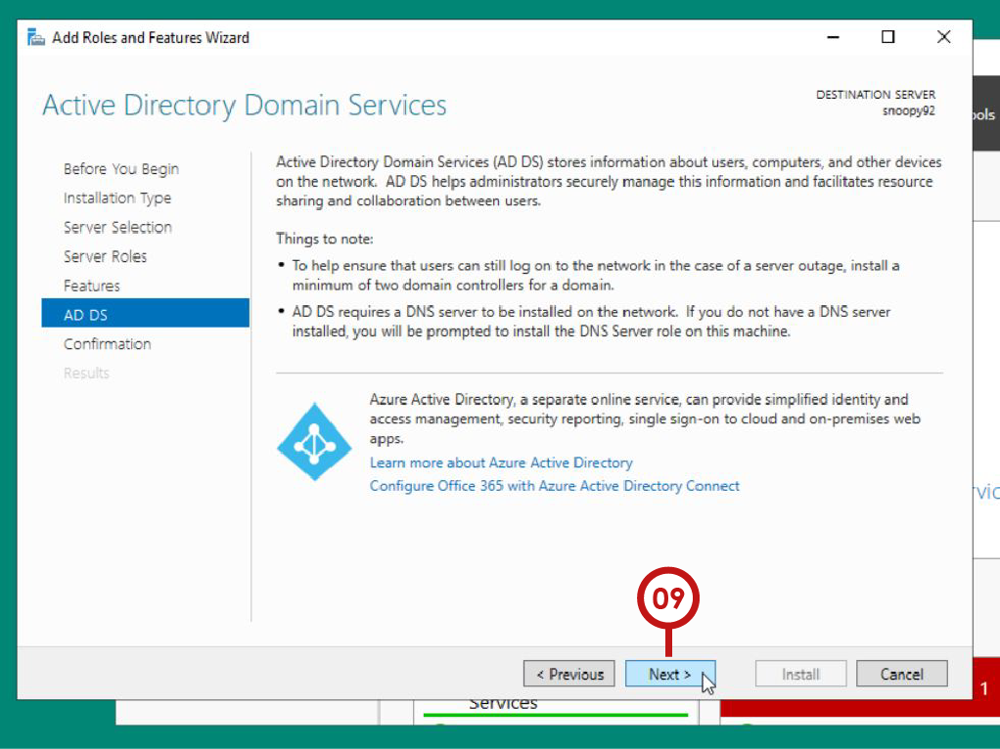
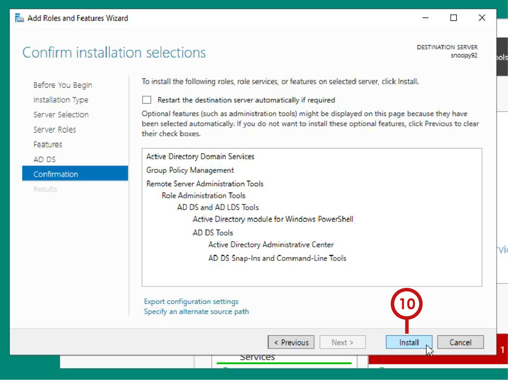
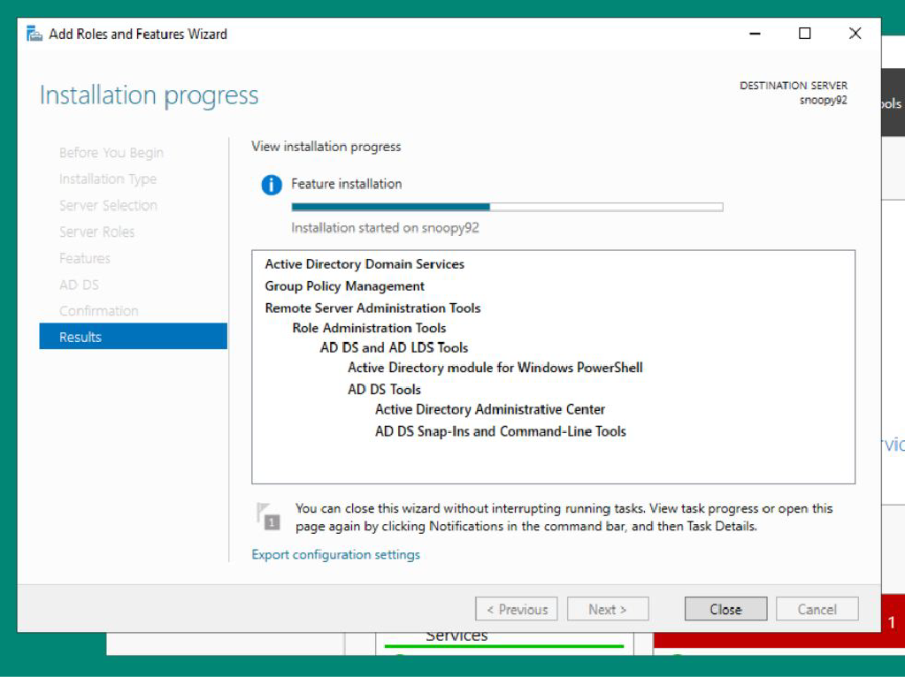

<!-- Your monitor number = #$34T# -->

# 💡 Install Active Directory Domains and Services

### 1. On Server Manager, go to Manage > `Add Roles and Features` __[01]__

 

&nbsp;
---
&nbsp;

### 2. Leave the initial prompt to defaults. Select `Next` __[02]__

 

&nbsp;
---
&nbsp;

### 3. Leave the initial prompt to defaults. Select `Next` __[03]__ again.

 

&nbsp;
---
&nbsp;

### 4. Select `Next` __[04]__
> [!IMPORTANT]
> The destination server is itself. The initial configuration is based on the Windows Server 2022 setup.

 

&nbsp;
---
&nbsp;

### 5. Select `Active Directory Domain Services` __[05]__
 

&nbsp;
---
&nbsp;

### 6. Select `Add Features` __[06]__
 

&nbsp;
---
&nbsp;

### 7. Select `Next` __[07]__
 

&nbsp;
---
&nbsp;

### 8. Don't select any Features. Simply select `Next` __[08]__
 

&nbsp;
---
&nbsp;

### 9. Select `Next` __[09]__
 

&nbsp;
---
&nbsp;

### 10. Finally, `Install` __[10]__
 

&nbsp;
---
&nbsp;

### 11. Wait for the Feature to install successfully.
 

&nbsp;
---
&nbsp;
